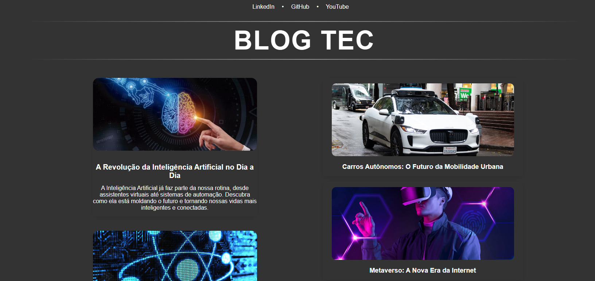
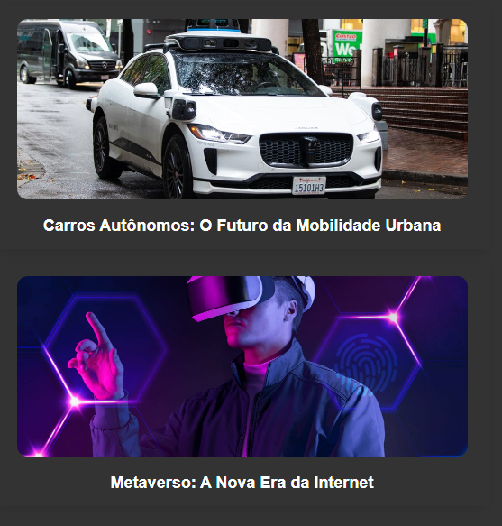

# Blog de Notícias de Tecnologia

Este é um projeto Angular criado com o intuito de aprender sobre components. Exibe um blog pessoal com notícias e tendências do universo da tecnologia. O blog apresenta uma interface moderna e responsiva, com seções de "Big Cards" para destaques e "Small Cards" para outras notícias.

## Tecnologias Utilizadas

- **Angular**: Framework principal para a construção da aplicação.
- **TypeScript**: Linguagem utilizada para o desenvolvimento.
- **CSS**: Estilização dos componentes.
- Outras bibliotecas e ferramentas que auxiliam no desenvolvimento (ex: Angular CLI).

### Home

A home page organizada em duas seções principais:
- **Artigos Principais (Big Cards):** Uma área dedicada aos destaques, onde cada card exibe uma imagem, título e descrição de uma notícia importante.
- **Outros Artigos (Small Cards):** Uma área que lista notícias secundárias em um formato mais compacto, com imagem e título.

Cada componente de card utiliza o Angular Router para permitir a navegação para uma página de conteúdo detalhado ao clicar no título ou imagem.

---

### Big Card

O componente **Big Card** é projetado para destacar as notícias mais relevantes. Ele exibe:
- **Imagem de Capa:** Uma imagem ilustrativa que representa a notícia.
- **Título:** O título da notícia, que é clicável e redireciona para a página de conteúdo detalhado.
- **Descrição:** Um breve resumo da notícia, também clicável para acessar mais detalhes.

---

### Small Card

O componente **Small Card** apresenta as notícias secundárias de forma mais compacta. Ele contém:
- **Imagem de Capa:** Uma imagem representativa da notícia.
- **Título:** O título da notícia, clicável e direcionado à página de detalhes do conteúdo.

## Conclusão

Este projeto foi desenvolvido como parte do bootcamp **Decola Tech 2025**, realizado pela **DIO.me** em parceria com a **Avanade**. Durante o desenvolvimento, foram aplicados conceitos fundamentais do **Angular**, com foco na criação e reutilização de **componentes**, estruturação de uma aplicação modular e boas práticas de desenvolvimento front-end.

O projeto serviu como uma excelente oportunidade para aprimorar conhecimentos sobre **componentização**, **roteamento** e a construção de interfaces dinâmicas utilizando **Angular**. Além disso, permitiu uma melhor compreensão sobre a importância de uma arquitetura bem definida para facilitar a escalabilidade e manutenção do código.

Com isso, o blog de notícias de tecnologia não apenas entrega uma interface responsiva e moderna, mas também representa um importante aprendizado no uso do **framework Angular**.
